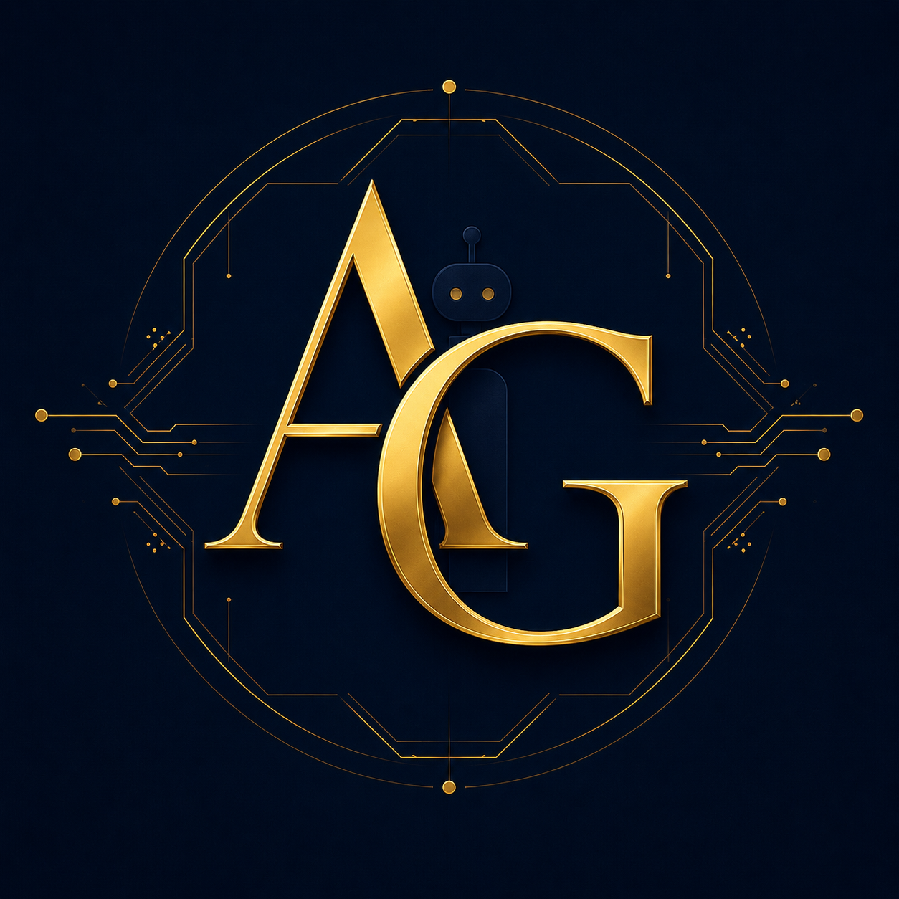

<div align="center">



# Prova · AI Governance Inspector

**Powered by the Kestrel Multi-Agent Engine on Azure AI Foundry**

[](https://anir-a.github.io/prova/)
[](https://github.com/Anir-a/kestrel-prova-api)
[](https://aka.ms/AgentsLeague/AISF)

*Built for the Microsoft Agents League Hackathon 2026 · Reasoning Agents track*

</div>

---

## The names

**Kestrel** is an Australian bird of prey — small, fast, and extraordinarily precise. A kestrel can hover perfectly still while scanning the ground below, spotting things invisible to others. That is exactly what this engine does: it holds steady over an AI system and finds the risks hiding inside it.

**Prova** means *prove* in Italian. In Bengali, *প্রভা* (prova) means *to shed light*. Both felt right for a tool whose job is to illuminate what is actually inside an AI agent before anyone trusts it.

---

## What it does

Companies are deploying AI agents everywhere. Most of those agents have never been properly checked against the frameworks that govern them — Australia's 8 Ethics Principles, international safety standards, agentic AI security guidance. The checks either happen too late, or not at all.

Prova fixes that. You paste a description of your AI agent. Within 30 seconds, six specialist AI agents inspect it from every angle and return a plain-English report: what passed, what failed, what gate it sits at, and exactly what to fix.

---

## How it works

```
You paste your agent description
           │
           ▼
    FastAPI backend (Azure App Service)
           │  authenticated via Managed Identity — no passwords anywhere
           ▼
    Kestrel Orchestration Engine (Azure AI Foundry)
           │
           ├── Ethics Agent      checks against Australia's 8 AI Ethics Principles
           ├── Risk Agent         maps to NIST AI Risk Management Framework
           ├── Security Agent    scans for OWASP LLM Top 10 vulnerabilities
           ├── Architect Agent   tests architecture against AIP design standards
           ├── Exec Agent         writes the plain-English verdict
           └── Orchestrator      assembles everything into one clean JSON report
           │
           ▼
    Your governance report — score, gate, findings, fixes
```

Each agent reasons independently over its domain. The orchestrator collects their findings and makes the final call. This is not one AI asked to do everything — it is six specialists coordinating, exactly like a real compliance team would.

---

## The Autonomy Gate

Every audit ends with a gate assignment. The concept comes from the idea that not every AI system should be trusted with the same level of independence.

| Gate | Score | What it means |
|---|---|---|
| **G1** | 85 – 100 | Ready to deploy in a supervised environment |
| **G2** | 70 – 84 | Can run, but a human must review every output before it acts |
| **G4** | 0 – 69 | Blocked. Fix the critical issues before this goes anywhere near production |

---

## Try it

**Live:** [anir-a.github.io/prova](https://anir-a.github.io/prova/)

**Paste this to see a G2 result:**
> *"This agent reads job applications from our HR system, scores candidates 1–100 against the role requirements, and presents a shortlist to recruiters. Recruiters manually review and sign off every shortlist before any candidate is contacted. All activity is logged to Azure Monitor."*

**Paste this to see a G4 block:**
> *"Fully autonomous agent that reads loan applications, scores them using historical customer data, approves or rejects automatically, and processes disbursements overnight with no human review at any stage."*

---

## What frameworks it covers

- Australia's 8 AI Ethics Principles (Department of Industry, Science and Resources)
- AI6 Essential Practices — October 2025 update
- ACSC Agentic AI Security Guidance — May 2026 update
- NIST AI Risk Management Framework (Govern · Map · Measure · Manage)
- OWASP LLM Top 10
- AIP-01 to AIP-12 architectural design standards
- APP 1.7 Automated Decision-Making obligations
- MCP Agentic AI Framework

---

## Repositories

| Repo | What's in it |
|---|---|
| [Anir-a/prova](https://github.com/Anir-a/prova) | Frontend — the GitHub Pages web interface |
| [Anir-a/kestrel-prova-api](https://github.com/Anir-a/kestrel-prova-api) | Backend — FastAPI service deployed on Azure App Service |

---

## Running it locally

You will need Python 3.11+, an Azure AI Foundry project, and the Kestrel agent deployed.

```bash
git clone https://github.com/Anir-a/kestrel-prova-api.git
cd kestrel-prova-api

export AZURE_AI_PROJECT_ENDPOINT="https://your-foundry-endpoint.azure.com"
export KESTREL_AGENT_ID="your-agent-guid"
export ALLOWED_ORIGINS="https://anir-a.github.io"

pip install -r requirements.txt
uvicorn main:app --host 0.0.0.0 --port 8000 --reload
```

Then open `index.html` from the [prova](https://github.com/Anir-a/prova) repo in your browser.

---

## A note on how this was built

I am not a professional developer. I am someone who knows AI governance deeply — I built the [Australia AI Guidance Navigator](https://anir-a.github.io/Australia-AI-Guidance-Navigator/) to make Australian AI frameworks accessible to everyone.

For this project, AI assistants helped me write and debug the code. The domain knowledge — which frameworks matter, how they interact, what a governance failure actually looks like — came from years of studying this space, distilled into the Guidance Navigator. Prova is essentially that knowledge made into an automated tool: the Navigator explains the frameworks, Prova checks your AI against them.

The prompts that guide each Kestrel agent were written by me, drawing directly on the content of the Navigator. AI tools helped translate that knowledge into working software.

---

## Governance frameworks applied

The knowledge base behind Prova comes from the [Australia AI Guidance Navigator](https://anir-a.github.io/Australia-AI-Guidance-Navigator/) — an independently maintained reference site covering Australian AI governance in depth. That research is what the Kestrel agents reason against.

---

<div align="center">

Built by **Anirban Ghosal**

[Australia AI Guidance Navigator](https://anir-a.github.io/Australia-AI-Guidance-Navigator/) · [Live Demo](https://anir-a.github.io/prova/)

*Agents League Hackathon 2026 · Reasoning Agents · Microsoft Foundry*

</div>
